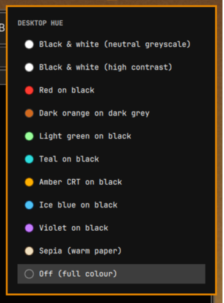

# Desktop hue

An Omarchy bar widget that tints your **entire desktop** with a duotone screen
shader. Click the palette icon, pick a hue, or drop back to full colour.



Because it runs as a Hyprland screen shader (`decoration:screen_shader`), the
tint applies to the final composited frame — every window, browsers, video,
games, the bar itself. No per-app configuration.

## Requirements

- Omarchy (Quattro or newer) with `omarchy-shell`
- Hyprland with `decoration:screen_shader` support

Nothing else — the shader script ships in this repo.

## Install

```bash
omarchy plugin add https://github.com/nzkritik/omarchy-desktop-hue --enable --yes
```

The widget lands in the bar's right section. Move it with:

```bash
omarchy bar move nzkritik.desktop-hue --section center
```

### External dependencies

None. The shader script ships in `bin/`, and the widget uses only Omarchy's own
`qs.Ui` kit and Hyprland.

## Remove

```bash
bin/omarchy-monochrome off                  # clear the shader first
omarchy plugin remove nzkritik.desktop-hue
```

Turning the shader off before removing is worth doing: it clears
`decoration:screen_shader` and deletes the `~/.config/hypr/shaders/current.frag`
symlink. Removing the plugin while a hue is active would leave your desktop
tinted with the plugin gone. If that happens, clear it by hand:

```bash
rm -f ~/.config/hypr/shaders/current.frag
hyprctl eval 'hl.config({ decoration = { screen_shader = "[[EMPTY]]" } })'
```

Generated shaders live in `~/.config/hypr/shaders/monochrome/` and can be
deleted freely.

### What it writes

Only its own files: generated `.frag` shaders under
`~/.config/hypr/shaders/monochrome/`, the `current.frag` symlink, and
`decoration:screen_shader` set at runtime via `hyprctl` — each only when you
pick a hue. It never edits your Hyprland or Omarchy config files.

Each shader is written to an exclusively created temporary file in that
directory and renamed into place, so a write is atomic and never follows a
symlink out of the shader directory. A destination that is not a regular file
is refused rather than written through.

## Use

Click the `󰸌` icon in the bar. The list shows every palette with a colour
swatch — the palette's highlight colour ringed by its midtone — and the active
one is highlighted. **Off (full colour)** at the bottom removes the shader.

Arrow keys or `j`/`k` move, Enter applies, Esc closes.

> While a hue is active the panel and its own swatches are tinted too. That is
> the shader doing its job on the composited frame, not a rendering bug.

## Adding your own hues

The palette table is the single source of truth, and it lives in
`bin/omarchy-monochrome`, not in the QML. Add a row:

```
# name|label|shadow|mid|highlight|gamma|contrast
"cyan-black|Cyan on black|#000000|#0b5c5c|#2fdede|0.85|1.10"
```

- `gamma` — below 1 lifts midtones, above 1 crushes them
- `contrast` — 1.0 is neutral, higher pushes blacks and whites apart

It appears in the bar list on the next open, swatch and all. The widget reads
the table via `omarchy-monochrome json`, so the two can never drift apart.

## Command line

The bundled script works standalone:

```bash
bin/omarchy-monochrome list              # show palettes
bin/omarchy-monochrome set teal-black    # apply one
bin/omarchy-monochrome set bw 0.5        # half strength
bin/omarchy-monochrome next              # cycle, then off, then round again
bin/omarchy-monochrome off
bin/omarchy-monochrome json              # what the widget reads
```

Put it on your `PATH` (e.g. symlink into `~/.local/bin`) if you also want a
keybinding — the widget prefers a copy on `PATH` when one exists, so you keep a
single install:

```lua
-- ~/.config/hypr/bindings.lua
o.bind("SUPER + SHIFT + H", "Cycle desktop hue", "omarchy-monochrome next")
```

## How it works

`Panel.qml` is a `bar-widget` built on Omarchy's `qs.Ui` kit (`Panel`,
`BarIconButton`, `KeyboardPanel`, `PanelKeyCatcher`). Applying a hue generates a
fragment shader into `~/.config/hypr/shaders/monochrome/<name>.frag`, points
`~/.config/hypr/shaders/current.frag` at it, and hands that to Hyprland. Turning
it off clears the symlink and the shader.

Luminance is measured in linear light and the ramp blended in gamma space, so a
neutral black → grey → white palette reproduces the original image's luminance
instead of lifting it.

## License

MIT — see [LICENSE](LICENSE).
